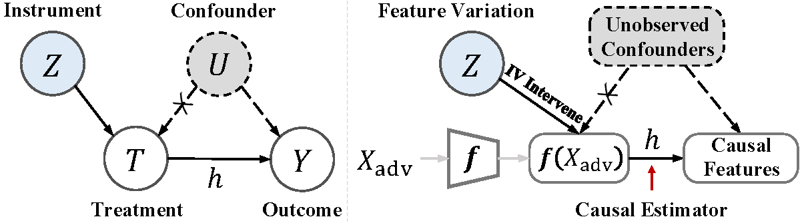
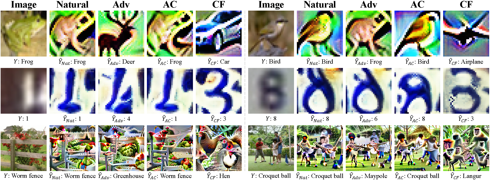

# CVPR 2023
[](https://pytorch.org/)
[](https://github.com/ByungKwanLee/Causal-Adversarial-Instruments/blob/master/LICENSE) 

# Title: [Demystifying Causal Features on Adversarial Examples and Causal Inoculation for Robust Network by Adversarial Instrumental Variable Regression](https://arxiv.org/abs/2303.01052)


---
#### Authors: [Junho Kim*](https://scholar.google.com/citations?user=ZxE16ZUAAAAJ&hl=en), [Byung-Kwan Lee*](https://scholar.google.co.kr/citations?user=rl0JXCQAAAAJ&hl=en)and [Yong Man Ro](https://scholar.google.co.kr/citations?user=IPzfF7cAAAAJ&hl=en) (*: equally contributed)
#### Affiliation: School of Electrical Engineering, Korea Advanced Institute of Science and Technology (KAIST)
#### Email: `arkimjh@kaist.ac.kr`, `leebk@kaist.ac.kr`, `ymro@kaist.ac.kr`


---

This is an Official PyTorch Implementation code for developing
Adversarial Instrumental Variable Regression based on Adversarial Moment Restriction on Generalized Method of Moments (AMR-GMM) and CAusal FEatures (CAFE).
This code is combined with below state-of-the-art technologies for
accelerating adversarial attacks and defenses with Deep Neural Networks
on Volta GPU architecture.

- [x] Distributed Data Parallel [[link]](https://pytorch.org/tutorials/intermediate/ddp_tutorial.html)
- [x] Channel Last Memory Format [[link]](https://pytorch.org/tutorials/intermediate/memory_format_tutorial.html#:~:text=Channels%20last%20memory%20format%20is,pixel%2Dper%2Dpixel)
- [x] Mixed Precision Training [[link]](https://openreview.net/forum?id=r1gs9JgRZ)
- [x] Mixed Precision + Adversarial Attack (based on torchattacks [[link]](https://github.com/Harry24k/adversarial-attacks-pytorch))
- [x] Faster Adversarial Training for Large Dataset [[link]](https://openreview.net/forum?id=BJx040EFvH)
- [x] Fast Forward Computer Vision (FFCV) [[link]](https://github.com/libffcv/ffcv)

---

We propose a way of delving into the unexpected vulnerability in adversarially trained networks
from a causal perspective, namely adversarial instrumental variable (IV) regression.
By deploying it, we estimate the causal relation of adversarial prediction 
under an unbiased environment dissociated from unknown confounders.
Our approach aims to demystify inherent causal features on adversarial examples
by leveraging a zero-sum optimization game between a casual feature estimator (i.e., hypothesis model)
and worst-case counterfactuals (i.e., test function) disturbing to find causal features.

<p align="center">

</p>


Through extensive analyses,
we demonstrate that the estimated causal features are highly 
related to the correct prediction for adversarial robustness, 
and the counterfactuals exhibit extreme features significantly 
deviating from the correct prediction. In addition, we present 
how to effectively inoculate CAusal FEatures (CAFE) into defense 
networks for improving adversarial robustness.

<p align="center">

</p>

---


## Our Framework (Top-Level File Directory Layout) 
    .
    ├── attack
    │   ├── fastattack.py               # Adversarial Attack Loader
    │   └── libfastattack               # Adversarial Attack Library
    │
    ├── cafe                            # Proposed Defense Methods
    │   ├── fast_train_cafe_adv.py      # ADV-CAFE
    │   ├── fast_train_cafe_trades.py   # TRADES-CAFE
    │   ├── fast_train_cafe_mart.py     # MART-CAFE
    │   ├── fast_train_cafe_awp.py      # AWP-CAFE
    │   └── fast_train_cafe_help.py     # HELP-CAFE
    │
    ├── defense                         # Five Defense Baselines
    │   ├── fast_train_cafe_adv.py      # ADV
    │   ├── fast_train_cafe_trades.py   # TRADES
    │   ├── fast_train_cafe_mart.py     # MART
    │   ├── fast_train_cafe_awp.py      # AWP
    │   └── fast_train_cafe_help.py     # HELP
    │
    ├── utils
    │   ├── fast_data_utils.py          # FFCV DataLoader
    │   ├── fast_network_utils.py       # Network Loader
    │   └── utils.py                    # Numerous Utility Tools
    │
    ├── models               
    │   ├── vgg.py                      # VGG
    │   ├── resnet.py                   # ResNet
    │   ├── wide.py                     # WideResNet
    │   ├── causal_network.py           # Causal Response Network for Implementing Hypothesis Model (h)
    │   └── instrument_network.py       # Instrument Network for Implementing Test Function (g)
    │
    ├── fast_dataset_converter.py       # Dataset Converter for beton extension
    ├── fast_pretrain_standard.py       # Stadnard Training
    ├── fast_pretrain_adv.py            # Adversarial Training
    ├── test_inversion.py               # Measuring Prediction Distance Metric of Causal Inversion
    ├── test_robustness.py              # Measuring Adversaril Robustness for Numerous Defense Methods
    ├── requirements.txt
    └── README.md


---


## Environment Setting

### Please check below settings to successfully run this code. If not, follow step by step during filling the checklist in.

- [ ] To utilize FFCV [[link]](https://github.com/libffcv/ffcv), you should install it on conda virtual environment.
I use python version 3.8, pytorch 1.7.1, torchvision 0.8.2, and cuda 10.1. For more different version, you can refer to PyTorch official site [[link]](https://pytorch.org/get-started/previous-versions/). 

> conda create -y -n ffcv python=3.8 cupy pkg-config compilers libjpeg-turbo opencv pytorch==1.7.1 torchvision==0.8.2 cudatoolkit=10.1 numba -c pytorch -c conda-forge

- [ ] or the latest cuda version (11.3) below

> conda create -y -n ffcv python=3.8 cupy pkg-config compilers libjpeg-turbo opencv pytorch torchvision cudatoolkit=11.3 numba -c pytorch -c conda-forge

- [ ] Activate the created environment by conda

> conda activate ffcv

- [ ] And, it would be better to install cudnn to more accelerate GPU. (Optional)

> conda install cudnn -c conda-forge

- [ ] To install FFCV, you should download it in pip and install torchattacks [[link]](https://github.com/Harry24k/adversarial-attacks-pytorch) to run adversarial attack.

> pip install ffcv torchattacks==3.1.0

- [ ] To guarantee the execution of this code, please additionally install library in requirements.txt (matplotlib, tqdm)

> pip install -r requirements.txt

### After making completion of environment settings, then you can follow how to run below.

* First, run `fast_dataset_converter.py` to generate dataset with `.betson` extension, instead of using original dataset [[FFCV]](https://github.com/libffcv/ffcv).

```python
# Future import build
from __future__ import print_function

# Import built-in module
import os
import argparse

# fetch args
parser = argparse.ArgumentParser()

# parameter
parser.add_argument('--dataset', default='cifar10', type=str)
parser.add_argument('--gpu', default='0', type=str)
args = parser.parse_args()

# GPU configurations
os.environ["CUDA_VISIBLE_DEVICES"]=args.gpu

# init fast dataloader
from utils.fast_data_utils import save_data_for_beton
save_data_for_beton(dataset=args.dataset)
```

* Second, run `fast_pretrain_standard.py`(Standard Training) or `fast_pretrain_adv.py` (Adversarial Training)

```python
# model parameter
import argparse
parser = argparse.ArgumentParser()
parser.add_argument('--dataset', default='cifar10', type=str)
parser.add_argument('--network', default='vgg', type=str)
parser.add_argument('--depth', default=16, type=int)
parser.add_argument('--gpu', default='0,1,2,3', type=str)
parser.add_argument('--port', default="12355", type=str)

# learning parameter
parser.add_argument('--learning_rate', default=0.1, type=float)
parser.add_argument('--weight_decay', default=0.0002, type=float)
parser.add_argument('--batch_size', default=128, type=float)
parser.add_argument('--test_batch_size', default=256, type=float)
parser.add_argument('--epoch', default=100, type=int)
```

or

```python
# model parameter
import argparse
parser = argparse.ArgumentParser()
parser.add_argument('--dataset', default='cifar10', type=str)
parser.add_argument('--network', default='vgg', type=str)
parser.add_argument('--depth', default=16, type=int)
parser.add_argument('--gpu', default='0,1,2,3', type=str)
parser.add_argument('--port', default="12355", type=str)
parser.add_argument('--load', default='false', type=str2bool)

# learning parameter
parser.add_argument('--learning_rate', default=0.1, type=float)
parser.add_argument('--weight_decay', default=0.0002, type=float)
parser.add_argument('--batch_size', default=128, type=float)
parser.add_argument('--test_batch_size', default=256, type=float)
parser.add_argument('--epoch', default=60, type=int)

# attack parameter
parser.add_argument('--attack', default='pgd', type=str)
parser.add_argument('--eps', default=0.03, type=float)
parser.add_argument('--steps', default=10, type=int)
```
---


## How to Get Hypothesis Model and Test Function for Finding Causal Features

run `fast_train_causal.py`

```python
# model parameter
parser.add_argument('--dataset', default='cifar10', type=str)
parser.add_argument('--network', default='vgg', type=str)

parser.add_argument('--depth', default=16, type=int)
parser.add_argument('--gpu', default='0,1,2,3', type=str)
parser.add_argument('--port', default='12355', type=str)

# learning parameter
parser.add_argument('--learning_rate', default=0.0001, type=float)
parser.add_argument('--weight_decay', default=0.00001, type=float)
parser.add_argument('--batch_size', default=128, type=float)
parser.add_argument('--test_batch_size', default=256, type=float)
parser.add_argument('--epoch', default=10, type=int)
parser.add_argument('--lamb', default=1, type=int)

# attack parameter
parser.add_argument('--attack', default='pgd', type=str)
parser.add_argument('--eps', default=0.03, type=float)
parser.add_argument('--steps', default=10, type=int)
parser.add_argument('--log_dir', type=str, default='logs', help='directory of training logs')
```

---

## Test Inversion & Robustness

- run `test_inversion.py`

```python
# model parameter
parser.add_argument('--dataset', default='cifar10', type=str)
parser.add_argument('--network', default='vgg', type=str)
parser.add_argument('--depth', default=16, type=int)
parser.add_argument('--base', default='adv', type=str)
parser.add_argument('--batch_size', default=256, type=float)
parser.add_argument('--gpu', default='0', type=str) # necessarily one gpu id!!!!
```

and


- run `test_robustness.py`

```python
# model parameter
parser.add_argument('--dataset', default='cifar10', type=str)
parser.add_argument('--network', default='vgg', type=str)
parser.add_argument('--depth', default=16, type=int)
parser.add_argument('--base', default='adv', type=str)
parser.add_argument('--batch_size', default=256, type=float)
parser.add_argument('--gpu', default='0', type=str) # necessarily one gpu id!!!!
```

---


### Available Datasets
Refer to *utils/fast_data_utils.py* and *utils/fast_network_utils.py*
* [CIFAR-10](https://www.cs.toronto.edu/~kriz/cifar.html)
* [SVHN](http://ufldl.stanford.edu/housenumbers/)
* [Tiny-ImageNet](https://www.kaggle.com/c/tiny-imagenet/overview)
* [ImageNet](https://www.image-net.org/)

---

### Available Baseline Models

* [VGG](https://arxiv.org/abs/1409.1556) (*models/vgg.py*)
* [ResNet](https://arxiv.org/abs/1512.03385) (*models/resnet.py*)
* [WideResNet](https://arxiv.org/abs/1605.07146) (*models/wide.py*)
---

### Available Adversarial Attacks (by [torchattacks](https://github.com/Harry24k/adversarial-attacks-pytorch))

* [FGSM](https://arxiv.org/abs/1412.6572) (*attack/libfastattack/FastFGSM.py*)
* [PGD](https://arxiv.org/abs/1706.06083) (*attack/libfastattack/FastPGD.py*)
* [CW](https://arxiv.org/abs/1608.04644) (*attack/libfastattack/FastCWLinf.py*)
* [AP](https://arxiv.org/abs/2003.01690) / [DLR](https://arxiv.org/abs/2003.01690) (*attack/libfastattack/APGD.py*)
* [AA](https://arxiv.org/abs/2003.01690) (*attack/libfastattack/AutoAttack.py*)


---

### Available Adversarial Defenses
> If you would like to run the code in 'defense' folder such as TRADES,MART,AWP,HELP, then you should first move the codes out of the folder and run it because of the system path error. 

* [ADV](https://arxiv.org/abs/1706.06083) (*fast_pretrain_adv.py*)
* [TRADES](https://arxiv.org/abs/1901.08573) (*defense/fast_train_trades.py*)
* [MART](https://openreview.net/forum?id=rklOg6EFwS) (*defense/fast_train_mart.py*)
* [AWP](https://arxiv.org/abs/2004.05884) (*defense/fast_train_awp.py*)
* [HELP](https://openreview.net/forum?id=Azh9QBQ4tR7) (*defense/fast_train_help.py*)

---

### Available Proposed Defense Methods
> If you would like to run the code in 'cafe' folder, then you should first move the codes out of the folder and run it because of the system path error.

* **`ADV-CAFE`** (*cafe/fast_train_cafe_adv.py*)
* **`TRADES-CAFE`** (*cafe/fast_train_cafe_trades.py*)
* **`MART-CAFE`** (*cafe/fast_train_cafe_mart.py*)
* **`AWP-CAFE`** (*cafe/fast_train_cafe_awp.py*)
* **`HELP-CAFE`** (*cafe/fast_train_cafe_help.py*)

---
